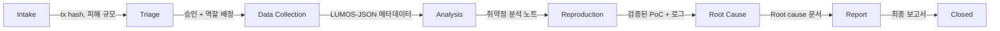

# LUMOS 내부 협업 플랫폼 — 컨셉 정의 문서

> **문서 성격**: 최종 기획안이 아닌 "기획 직전 단계의 컨셉 정의". 이후 와이어프레임, 데이터 모델, API 명세로 확장하기 위한 구조적 토대.
> **작성일**: 2026-03-29

---

## 1. 프로젝트의 본질적 문제 정의

### 1.1 표면적 문제: "Notion이 불편하다"가 아니다

팀이 겪는 문제를 "Notion UI가 구리다"로 축소하면 해결책도 "예쁜 Notion 템플릿"으로 끝난다. 실제 문제는 더 구조적이다.

### 1.2 근본 원인 분석

**① 정보 유형의 미분리**

Notion 페이지 하나에 아래 성격이 완전히 다른 정보가 뒤섞여 있다:

| 정보 유형 | 성격 | 예시 |
|-----------|------|------|
| 참조 자료 | 읽기 전용, 시간에 따라 가치 감소 없음 | TxRay 논문 정리, TracExp 요약 |
| 회의 기록 | 읽기 전용, 시점 종속 | 3/15 회의록 |
| 태스크 | 상태가 변하는 실행 단위 | "CrossCurve tx 파싱 스크립트 작성" |
| 산출물 | 작업 결과로 생긴 파일/코드/분석 결과 | 디컴파일 결과 JSON, PoC .t.sol |
| 논의/의견 | 특정 맥락에 묶인 짧은 커뮤니케이션 | "이 함수가 진짜 취약점인지 확인 필요" |

Notion은 이 모든 것을 "페이지"라는 단일 단위로 취급한다. 페이지의 성격(읽기용 vs 실행용)을 구분하는 구조가 없으므로, 시간이 갈수록 "지금 봐야 할 것"과 "나중에 참고할 것"이 섞인다.

**② "읽는 정보"와 "실행하는 일"이 섞일 때 벌어지는 일**

- 논문 정리 페이지 옆에 "tx 파싱 담당자 지정" 태스크가 놓인다.
- 팀원은 Notion을 열 때마다 "이게 내가 읽어야 하는 건지, 해야 하는 건지"를 판단해야 한다.
- 이 판단 비용이 쌓이면 → Notion을 안 열게 되거나, 열어도 자기 할 일을 못 찾게 된다.
- 결과: "누가 지금 뭘 하고 있는지 모른다." 이 상태가 지금이다.

**③ 케이스 단위 추적의 부재**

이 프로젝트는 본질적으로 **케이스(exploit incident) 단위**로 움직인다. 하나의 exploit이 들어오면:
- tx hash 추출 → 데이터 파싱 → 디컴파일 → PoC 재현 → root cause 식별 → 보고서

이 전체가 하나의 "케이스"다. 그런데 Notion에서는 이 흐름이 여러 페이지에 흩어지거나, 아예 하나의 긴 문서에 뭉쳐져 있다. **하나의 exploit에 대한 전체 상태를 한눈에 볼 수 없다.**

**④ 역할 간 핸드오프 지점의 부재**

팀이 세 갈래(tx data / decompile / workflow)로 나뉘었다는 건, 작업이 한 사람에서 다른 사람으로 "넘어가는 지점"이 존재한다는 뜻이다. Notion에는 이 핸드오프를 구조적으로 표현할 방법이 없다. 상태 컬럼을 만들어도, 그것이 "누구에서 누구로 넘어간 건지"를 보여주진 않는다.

### 1.3 왜 단일 문서 허브로는 안 되는가

| 문서 허브의 가정 | 이 프로젝트의 현실 |
|---|---|
| 정보는 주로 읽힌다 | 정보는 읽히고, 실행되고, 변형되고, 넘겨진다 |
| 구조가 정적이다 | 케이스마다 동적으로 태스크가 생성되고 상태가 바뀐다 |
| 하나의 뷰면 충분하다 | 역할마다 봐야 하는 정보가 다르다 |
| 시간순 정렬이면 된다 | 케이스별 × 단계별 매트릭스가 필요하다 |

**결론**: Notion은 "지식 저장소"로는 유효하지만, "운영 시스템"으로는 구조적으로 한계가 있다. 지금 필요한 건 운영 시스템이다.

---

## 2. 이 내부 웹의 핵심 정체성 정의

### 2.1 이 웹은 정확히 무엇인가

후보군을 평가한다:

| 정체성 | 적합도 | 이유 |
|--------|--------|------|
| 문서 도구 | ✗ | Notion이 이미 한다. 또 만들 이유 없다 |
| 태스크 관리 도구 | △ | 필요하지만 그것만으로는 케이스 흐름을 못 잡는다 |
| 운영 콘솔 | △ | 나중엔 맞지만 지금은 실행할 자동화가 아직 없다 |
| 케이스 관리 시스템 | ◎ | 핵심. exploit 단위로 모든 것을 묶어야 한다 |
| 협업 플랫폼 | ○ | 케이스 관리 위에 역할/핸드오프/논의가 얹혀야 한다 |

### 2.2 정체성 우선순위

```
1순위: 케이스 관리 시스템 (Case Tracker)
2순위: 팀 협업 레이어 (역할, 핸드오프, 코멘트)
3순위: 운영 대시보드 (상태 한눈에 보기)
------- 미래 경계 -------
4순위: 실행 콘솔 (GCP 잡 트리거, MCP 연결)
5순위: 외부 공개 인터페이스 (랜딩, 데모)
```

### 2.3 지금 단계 vs 미래 단계

| | 지금 (Phase 1) | 미래 (Phase 2+) |
|---|---|---|
| 정체성 | 케이스 중심 내부 협업툴 | 자동화 실행 + 외부 공개 가능 플랫폼 |
| 핵심 가치 | "누가 뭘 하고 있는지 안다" | "버튼 하나로 분석이 돌아간다" |
| URL 구조 | `/app` (메인), `/` (최소 랜딩) | `/app` + `/console` + `/public` |

### 2.4 왜 자동화보다 협업이 먼저인가

자동화 파이프라인(5-Agent 구조)은 각 Agent의 입출력 스펙이 확정되어야 구현할 수 있다. 그 스펙은 팀이 실제로 수동으로 케이스를 여러 번 처리하면서 정제된다. 협업 구조 없이 자동화부터 만들면:
- 입출력 스펙이 흔들리면서 자동화 코드를 계속 다시 짜게 된다.
- "자동화를 만드는 작업" 자체의 협업이 안 되어 자동화 개발도 느려진다.

즉, **협업 구조는 자동화의 전제 조건**이다.

---

## 3. 사용자/역할 관점 정리

### 3.1 역할 추상화

7명의 팀원을 고정 직군이 아닌 **유동적 역할 슬롯**으로 추상화한다. 한 사람이 케이스에 따라 다른 역할을 맡을 수 있어야 한다.

| 역할 슬롯 | 설명 | 케이스별 할당 |
|-----------|------|-------------|
| **Lead** | 케이스 전체 흐름 관장. 상태 전환 승인, 최종 리뷰 | 케이스당 1명 |
| **Data** | tx hash로부터 raw data 추출, 가공, 구조화 | 케이스당 1~2명 |
| **Analysis** | 디컴파일 결과 분석, 취약점 식별, 코드 비교 | 케이스당 1~2명 |
| **Reproduction** | PoC 작성 / 재현 실행 / 검증 | 케이스당 1명 |
| **Report** | 분석 결과를 구조화된 보고서로 정리 | 케이스당 1명 |

> **핵심 원칙**: 역할은 팀원에 고정되는 것이 아니라, **케이스에 할당**되는 것이다. A가 Case-1에서는 Data를 하고, Case-2에서는 Analysis를 할 수 있다.

### 3.2 역할별 웹 인터랙션

| 역할 | 보아야 하는 것 | 입력하는 것 | 넘기는 것 |
|------|--------------|------------|----------|
| Lead | 전체 케이스 상태, 병목 지점 | 케이스 생성, 역할 배정, 상태 승인 | 아무것도 (관리만) |
| Data | 자기 케이스의 tx 정보, 요구사항 | 파싱 결과 JSON, 추출 데이터 | 구조화된 메타데이터 → Analysis로 |
| Analysis | Data가 넘긴 메타데이터, 디컴파일 결과 | 분석 노트, 취약점 시그니처 | 분석 결과 → Reproduction으로 |
| Reproduction | 분석 결과, 코드 스니펫 | PoC 파일, 실행 로그 | 검증된 PoC → Report로 |
| Report | 전체 케이스 산출물 | 보고서 초안 | 최종 보고서 → Lead 리뷰 |

### 3.3 핸드오프가 중요한 이유

핸드오프 = "내 작업이 끝났고, 다음 사람이 시작할 수 있는 상태"를 **명시적으로 선언**하는 행위.

이게 없으면:
- Data 담당자가 결과를 Notion에 올려놨지만, Analysis 담당자가 그걸 모른다.
- Analysis가 끝났는데, Reproduction 담당자가 "언제 시작하면 되는지" 모른다.
- 최종적으로 Lead가 "지금 전체 진행률이 몇 %인지" 파악 불가.

**핸드오프 = 상태 전환 + 알림 + 산출물 확인**이 한 묶음으로 일어나야 한다.

---

## 4. "케이스 중심" 운영 구조의 필요성

### 4.1 왜 task 중심이 아닌가

일반적인 프로젝트 관리 도구(Jira, Linear)는 **task 중심**이다. 하지만 이 프로젝트에서 task는 항상 **특정 exploit 케이스에 종속**된다.

- "디컴파일 스크립트 작성"은 범용 task.
- "CrossCurve exploit의 target contract 디컴파일"은 **Case에 묶인 task**.

task만 관리하면 "이 task가 어떤 exploit을 위한 건지" 맥락이 사라진다. 반대로 case 중심으로 관리하면 task는 자연스럽게 case 안에 배치된다.

### 4.2 exploit 케이스의 생명주기

```
[Intake] → [Triage] → [Data Collection] → [Analysis] → [Reproduction] → [Root Cause] → [Report] → [Closed]
```

각 단계 상세:

| 단계 | 진입 조건 | 핵심 활동 | 산출물 |
|------|----------|----------|--------|
| Intake | exploit 후보 발견 | tx hash, 피해 규모, 프로토콜 기록 | 초기 케이스 카드 |
| Triage | 케이스 카드 존재 | 분석 가치 판단, 우선순위, 역할 배정 | 승인된 케이스 + 담당자 |
| Data Collection | 역할 배정 완료 | RPC 요청, tx trace, token flow 추출 | 구조화된 메타데이터 (LUMOS-JSON) |
| Analysis | 메타데이터 존재 | 디컴파일, 코드 비교, 패턴 매칭 | 취약점 분석 노트, 시그니처 |
| Reproduction | 분석 결과 존재 | PoC 작성, fork test 실행 | 검증된 PoC 코드 + 실행 로그 |
| Root Cause | PoC 검증 완료 | 근본 원인 식별, 분류 | Root cause 문서 |
| Report | 모든 산출물 존재 | 보고서 작성 | 최종 보고서 |
| Closed | 보고서 리뷰 완료 | 아카이빙 | — |

### 4.3 정보 단위 개념 구분

| 개념 | 정의 | Notion에서의 문제 |
|------|------|------------------|
| **Case** | exploit 하나에 대한 전체 작업 묶음 | 존재하지 않음. 흩어진 페이지들의 암묵적 연결 |
| **Task** | case 안의 구체적 실행 단위 | 문서와 구분 안 됨 |
| **Artifact** | task의 결과물 (파일, 코드, JSON) | 페이지 본문에 인라인으로 묻힘 |
| **Discussion** | 특정 case/task에 대한 논의 | 별도 페이지 or Slack으로 분산 |
| **Report** | case의 최종 산출물 | artifact와 구분 안 됨 |

**산출물(Artifact) / 논의(Discussion) / 상태(Status) 분리가 필요한 이유:**
- Artifact는 **버전 관리**가 필요하다 (디컴파일 v1 → v2).
- Discussion은 **시간순**으로 쌓인다.
- Status는 **현재 상태 하나**만 중요하다.
- 이 세 가지를 하나의 Notion 페이지에 넣으면, 최신 상태를 확인하려고 스크롤을 끝까지 내려야 한다.

---

## 5. 1차 제품 범위(MVP)와 2차 확장 범위 구분

### 5.1 3단계 분류

| 기능 | 분류 | 근거 |
|------|------|------|
| **케이스 생성** | 🟢 지금 필요 | 운영의 최소 단위. 이것 없으면 도구가 아니다 |
| **상태 관리 (단계 전환)** | 🟢 지금 필요 | "지금 어디까지 왔는지"가 협업의 핵심 |
| **담당자 배정 (역할 슬롯)** | 🟢 지금 필요 | "누가 하는지" 모르면 아무도 안 한다 |
| **코멘트/토론** | 🟢 지금 필요 | Slack 분산을 줄이고 맥락 보존 |
| **파일/링크/산출물 첨부** | 🟢 지금 필요 | 산출물이 케이스에 묶여야 의미 있다 |
| **단계별 핸드오프 알림** | 🟢 지금 필요 | 자동 알림 없으면 핸드오프가 깨진다 |
| **대시보드 (전체 케이스 현황)** | 🟢 지금 필요 | Lead가 전체를 볼 수 있어야 한다 |
| **회의록 연결** | 🟡 곧 필요 | 케이스에 관련 회의 링크 정도면 충분. 회의록 자체는 Notion |
| **케이스 템플릿** | 🟡 곧 필요 | 반복 작업이 생기면 그때 |
| **타임라인/이벤트 로그** | 🟡 곧 필요 | 운영이 돌아간 후 회고/분석에 필요 |
| **자동 실행 버튼** | 🔴 나중 | 실행할 자동화 파이프라인이 아직 없다 |
| **GCP 잡 실행** | 🔴 나중 | 인프라 연동은 파이프라인 확정 후 |
| **MCP 연결** | 🔴 나중 | 인터페이스 스펙 자체가 미확정 |
| **보고서 자동 생성** | 🔴 나중 | 수동 보고서를 여러 번 써본 후 패턴이 나와야 자동화 가능 |
| **외부 공개용 랜딩페이지** | 🔴 나중 | 내부 도구가 먼저. 랜딩은 보여줄 것이 생긴 후 |

### 5.2 제외 이유 요약

🔴 항목들의 공통점: **입출력 스펙이 아직 확정되지 않았다.**

자동화 버튼을 만들어 놓아도 뒤에서 돌아갈 코드가 없다. GCP 잡 정의가 없다. MCP 프로토콜이 결정 안 됐다. 보고서 템플릿이 없다. 이 상태에서 UI를 먼저 만들면, 스펙이 바뀔 때마다 UI도 같이 바꿔야 한다. **사용 가능한 것만 먼저 만든다.**

---

## 6. 내부 협업툴로서 필요한 정보 구조(IA) 컨셉

### 6.1 핵심 정보 단위

```
Case ──┬── Task (1:N)
       ├── Artifact (1:N)
       ├── Discussion (1:N)
       ├── Assignment (역할 슬롯 배정)
       └── Report (1:1, 최종 산출물)

Team Member ── Assignment를 통해 Case에 연결
Timeline/Event Log ── Case의 모든 상태 변화 기록
```

### 6.2 각 정보 단위의 역할

| 단위 | 역할 | Notion에서 왜 문제였는가 |
|------|------|----------------------|
| **Case** | 하나의 exploit incident 전체를 담는 컨테이너 | 존재하지 않음. 모든 것이 flat한 페이지 목록 |
| **Task** | case 안에서 수행해야 할 구체적 작업 | 문서와 혼재. "이게 할 일인지 읽을 거인지" 구분 불가 |
| **Artifact** | 작업의 결과물. 파일, 코드, 데이터 | 페이지 본문에 묻혀서 찾기 어려움 |
| **Discussion** | case나 task에 대한 맥락 있는 논의 | Slack으로 분산되어 맥락 유실 |
| **Assignment** | "누가 이 case의 어떤 역할인지" 명시 | 텍스트로 적어놓으면 업데이트 안 됨 |
| **Report** | case의 최종 결과물 문서 | artifact와 구분 없음 |
| **Event Log** | 상태 변화, 핸드오프, 산출물 업로드 등의 이력 | 존재하지 않음 |

### 6.3 URL 구조 컨셉

```
/                    → 최소 랜딩 (프로젝트 소개 한 줄 + /app으로 리디렉트)
/app                 → 메인 대시보드 (기본 진입점)
/app/cases           → 케이스 목록
/app/cases/:id       → 케이스 상세 (task, artifact, discussion 포함)
/app/my              → 내 할당 케이스/태스크
/app/team            → 팀원별 현황

(미래)
/app/console         → 자동화 실행 콘솔
/app/reports         → 보고서 아카이브
/public              → 외부 공개 페이지
```

---

## 7. 운영 흐름 컨셉

### 7.1 흐름 원칙

단순히 "기능 순서"가 아니라, 팀이 헷갈리지 않기 위한 **운영 규칙**:

1. **한 케이스, 한 Lead**: 모든 케이스에 반드시 Lead가 있어야 한다. Lead 없는 케이스는 진행 불가.
2. **명시적 핸드오프**: 내 단계가 끝나면 "다음 단계로 넘김" 액션을 해야 한다. 자동으로 넘어가지 않는다.
3. **산출물 없는 전환 금지**: 단계를 넘기려면 최소 하나의 artifact가 첨부되어야 한다.
4. **역방향 전환 허용**: 분석 중 데이터가 부족하면 Data Collection으로 되돌릴 수 있다.

### 7.2 단계별 입출력



| 전환 | 입력 (이전 단계 산출물) | 출력 (이 단계 산출물) | 핸드오프 주체 |
|------|----------------------|---------------------|-------------|
| → Intake | 외부 시그널 (SNS, Forta 등) | 초기 케이스 카드 | 발견자 → Lead |
| → Triage | 케이스 카드 | 분석 가치 판단 + 담당자 배정 | Lead |
| → Data Collection | 승인된 케이스 | 구조화된 tx 메타데이터 | Lead → Data |
| → Analysis | 메타데이터 JSON | 디컴파일 결과, 취약점 시그니처 | Data → Analysis |
| → Reproduction | 분석 노트 | PoC 코드 + 실행 결과 | Analysis → Reproduction |
| → Root Cause | 검증된 PoC | Root cause 식별 문서 | Reproduction → Analysis/Lead |
| → Report | 전체 산출물 | 최종 보고서 | Lead → Report |
| → Closed | 보고서 리뷰 완료 | — | Lead |

---

## 8. Slack / Notion / 내부 웹의 역할 분담

### 8.1 역할 분담 제안

| 도구 | 역할 | 이유 |
|------|------|------|
| **내부 웹** | 운영의 Source of Truth | 케이스 상태, 담당자, 산출물, 핸드오프의 단일 진실 소스 |
| **Slack** | 알림 수신 + 빠른 대화 | 케이스 상태 변경 시 Slack 알림. 즉각적 논의는 Slack, 결론은 웹에 기록 |
| **Notion** | 장기 아카이브 + 참조 자료 | 논문 정리, 회의록, 기술 문서. 운영 정보는 넣지 않음 |

### 8.2 핵심 입장: 내부 웹이 Source of Truth여야 하는가?

**예. 반드시 그래야 한다.**

이유:
- Source of Truth가 분산되면 "어디를 봐야 최신인지" 모른다.
- Slack은 흘러가고, Notion은 업데이트가 안 되는 경향이 있다.
- 내부 웹만이 **상태 전환 강제, 산출물 첨부 강제, 핸드오프 기록**을 구조적으로 할 수 있다.

### 8.3 Notion 완전 제거?

**하지 않는다.** Notion은 "읽기 전용 장기 참조 자료"로 유지한다. 논문 정리, 기술 레퍼런스, 회의록은 여전히 Notion이 적합하다. 다만 **운영 관련 정보(누가 뭘 하는지, 케이스 상태)는 Notion에서 완전히 빼야 한다.** 두 곳에 같은 정보를 유지하려고 하면 반드시 어긋난다.

---

## 9. 화면 철학 및 UX 방향성

### 9.1 UX 원칙

| 원칙 | 설명 |
|------|------|
| **상태 가시성 최우선** | 첫 화면에서 "전체 케이스가 어떤 상태인지" 즉시 파악 가능 |
| **운영 대시보드형** | 마케팅 랜딩이 아닌, 로그인하면 바로 작업 현황이 보이는 구조 |
| **케이스/흐름 중심** | 문서 나열이 아니라, 파이프라인 단계별로 케이스가 배치 |
| **정보 밀도 조절** | 대시보드는 요약, 케이스 상세는 depths. 한 화면에 모든 것 X |
| **역할별 필터링** | "내 할 일"이 자연스럽게 먼저 보임 |

### 9.2 톤앤매너

- **"Analysis Workspace"** 느낌이 가장 적합하다.
  - "관제실(Control Room)"은 실시간 모니터링 중심 → 지금은 실시간 피드가 없음.
  - "오퍼레이션 보드"는 맞지만, 단어가 너무 범용적.
  - "Incident Room"은 긴급 대응 느낌 → 우리는 사후 분석이 주 업무.
  - **"Analysis Workspace"**: 분석 작업을 체계적으로 수행하는 공간. 차분하지만 구조적.

- **색상**: 다크 모드 기본. 보안/분석 도구 특유의 차분한 톤. 상태 표시에는 명확한 색상 코드.
- **타이포그래피**: 모노스페이스(tx hash, 코드) + 산세리프(UI 텍스트) 혼용.
- **밀도**: Linear / GitHub Issues 수준의 정보 밀도. Notion 수준의 여백은 과하다.

---

## 10. 냉정한 평가

### 10.1 장점

- 케이스 중심 구조가 잡히면, 추후 자동화 기능을 **케이스 단위로** 자연스럽게 붙일 수 있다.
- 팀원 7명의 작업 분담이 투명해져서 **책임 소재가 명확**해진다.
- 수동으로 여러 케이스를 처리하면서 **자동화 스펙이 자연스럽게 정제**된다.
- 내부 웹을 직접 만들면 향후 GCP 연동, MCP 통합 등의 **확장이 자유롭다**.

### 10.2 리스크

| 리스크 | 심각도 | 대응 |
|--------|--------|------|
| **협업툴 직접 개발의 공수** | 🔴 높음 | MVP를 극도로 좁혀야 한다. 케이스 CRUD + 상태 전환 + 코멘트까지만. |
| **7명에 과한 설계** | 🟡 중간 | 7명이면 사실 Slack 채널 + 스프레드시트로도 가능. 웹을 만드는 건 "지금"이 아니라 "곧 올 자동화 통합"을 위해서다. 이 관점을 잃으면 과잉 설계가 된다. |
| **도구를 만드느라 본 작업이 밀림** | 🔴 높음 | 웹 개발은 1명(본인)이 전담하되, 1차 MVP는 2주 이내 목표. 나머지 6명은 본 작업 계속. |
| **자동화 욕심 조기 투입** | 🔴 높음 | 지금 "실행 버튼"을 만들면 뒤에서 돌아갈 게 없어서 빈 껍데기가 된다. 팀의 신뢰를 잃는다. |
| **Notion/Slack을 계속 병행하는 비용** | 🟡 중간 | 명확하게 역할을 나누면( §8 참조) 오히려 각 도구의 장점을 살릴 수 있다. 문제는 "같은 정보를 두 곳에 유지"할 때 생긴다. |

### 10.3 무엇을 포기해야 빨라지는가

1. **지금 랜딩페이지를 꾸미는 것** → `/`는 `/app`으로 리디렉트만 하면 된다. 디자인은 나중.
2. **자동화 연동 UI** → 2차 범위. 지금은 수동 입력으로 충분.
3. **완벽한 권한/인증 시스템** → 7명 내부 팀이다. 초기엔 간단한 인증이면 된다.
4. **보고서 자동 생성** → 수동 보고서를 최소 5건 이상 작성해 본 후에야 패턴이 보인다.
5. **Notion 데이터 마이그레이션** → 기존 Notion은 아카이브로 두고, 새 케이스부터 웹에서 시작.

### 10.4 내부 웹을 먼저 만드는 게 맞는가?

**조건부로 맞다.** 조건:
- MVP를 2주 내에 끝낼 수 있을 만큼 범위를 좁힐 것.
- 나머지 팀원은 웹 개발을 기다리지 않고, 기존 방식으로 첫 번째 케이스를 수동 처리할 것.
- 첫 번째 수동 케이스의 산출물과 흐름이 웹의 초기 데이터이자 검증이 될 것.

만약 이 조건을 못 지키면(개발이 한 달 넘어가면), 차라리 Linear나 GitHub Projects를 커스터마이징하는 게 낫다.

---

## 11. 최종 정리

### 11.1 한 줄 정의

> **LUMOS 내부 웹은 "DeFi exploit 분석 케이스를 팀이 체계적으로 추적하고 협업하기 위한 케이스 관리 워크스페이스"다.**

### 11.2 핵심 원칙

1. **Case-First**: 모든 것은 케이스에 묶인다. 케이스 밖에 떠도는 태스크나 산출물은 없다.
2. **명시적 핸드오프**: 단계 전환은 자동이 아니라 의도적 행위다. 산출물 없이 넘기지 않는다.
3. **협업 먼저, 자동화 나중**: 수동 운영이 매끄럽게 돌아간 후에 자동화를 붙인다.
4. **Source of Truth는 하나**: 운영 정보는 내부 웹에만 존재한다. 복제하지 않는다.
5. **MVP는 2주**: 케이스 CRUD + 상태 전환 + 역할 배정 + 코멘트 + 산출물 첨부. 이것만.

### 11.3 기획안으로 넘어갈 때 가장 먼저 구체화할 항목

| 순서 | 항목 | 이유 |
|------|------|------|
| 1 | **케이스 데이터 모델 정의** | Case, Task, Artifact, Assignment의 필드/관계를 확정해야 모든 UI가 따라온다 |
| 2 | **상태 머신(State Machine) 설계** | 케이스 단계 전환 규칙, 역방향 허용 조건, 필수 산출물 등을 명세화 |
| 3 | **대시보드 와이어프레임** | 첫 화면(`/app`)에서 무엇을 보여줄지. 칸반 vs 테이블 vs 파이프라인 뷰 |
| 4 | **기술 스택 확정** | 프론트(Next.js/Vite), 백엔드(API), DB, 인증 방식 결정 |
| 5 | **첫 번째 케이스 시뮬레이션** | 실제 exploit 하나를 웹 구조에 맞춰 수동으로 등록해보면서 구조 검증 |
