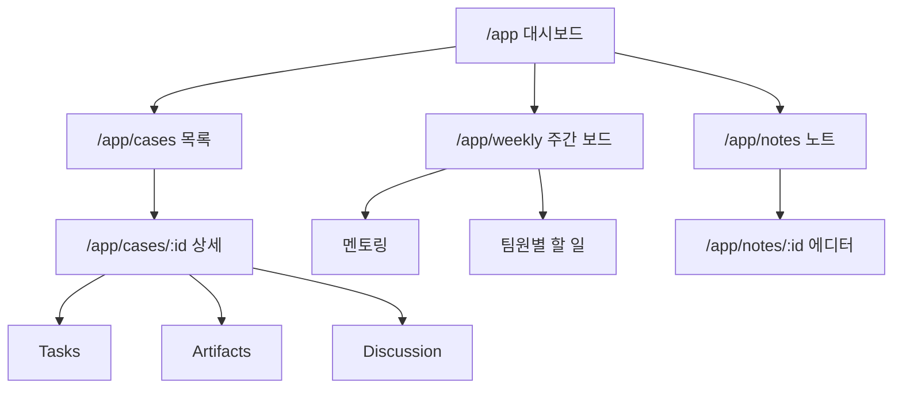

# LUMOS 내부 협업 플랫폼 — 최종 구현 기획서

> **문서 성격**: 구현 직전 단계의 기획서. 화면 구성, 데이터 구조, 운영 흐름을 정의한다. 코드 레벨 설계(implementation plan)는 별도 진행.
> **작성일**: 2026-03-29
> **목표 기한**: 오늘 밤 MVP 완성 (병렬 에이전트 작업)

---

## 0. 확정된 결정사항 요약

| # | 주제 | 결정 |
|---|---|---|
| 1 | Notion | **완전 대체**. 내부 웹이 모든 기록의 single source. Planfit journal 에디터 패턴 레퍼런스 |
| 2 | Task 구조 | **단일 Task**. Case에서 Task를 쪼개고 각자가 맡아 처리. label/tag로 성격 구분 |
| 3 | 역할 체계 | **Case 단위 유동 배정**. 고정 슬롯 없이, Case별 Task 할당으로 역할 결정 |
| 4 | 주간/멘토링 | **MVP 포함**. Weekly Plan + 역할 분담 + 멘토링 메모까지 |
| 5 | 케이스 단계 | **Coarse state + 유동 workstream**. 큰 틀만 잡고 세부는 케이스별 상이 |
| 6 | Decision 객체 | **별도 불필요**. 계획으로 확정되면 결정된 것. 별도 객체 과잉 |
| 7 | MVP 범위 | **오늘 밤 완성**. 핵심만 극도로 좁게 |

---

## 1. 제품 정의

### 1.1 한 줄 정의

> **exploit 분석 케이스를 중심으로 팀 운영·기록·추적을 한 곳에서 하는 내부 협업 워크스페이스**

### 1.2 핵심 원칙

1. **Case-First**: 모든 Task와 산출물은 Case에 귀속된다
2. **Single Source of Truth**: Notion 완전 대체. 이 웹이 유일한 운영/기록 도구
3. **유동적 구조**: 역할, 워크플로우 단계, 조사 범위가 프로젝트 진행에 따라 바뀔 수 있음을 전제
4. **주간 운영 중심**: 멘토링 주기에 맞춘 주간 계획/회고 구조
5. **협업 먼저, 자동화 나중**: 자동화 도구는 Post-MVP

---

## 2. URL 구조

```
/                    → 최소 랜딩 (한 줄 소개 + /app 리디렉트)
/app                 → 메인 대시보드 (기본 진입점. 로그인 후 랜딩)
/app/cases           → 케이스 목록
/app/cases/:id       → 케이스 상세 (Task, Artifact, Discussion 포함)
/app/weekly          → 주간 운영 보드 (이번 주 목표, 역할, 멘토링)
/app/notes/:id       → 노트/문서 에디터 (Notion 대체, Tiptap 기반)

(Post-MVP)
/app/console         → 자동화 실행 콘솔
/app/reports         → 보고서 아카이브
/public              → 외부 공개용
```

---

## 3. 데이터 모델 (개념 수준)

코드 레벨 스키마는 implementation plan에서 정의. 여기서는 관계와 역할만.

### 3.1 핵심 엔티티

```
Case ──┬── Task (1:N)
       ├── Artifact (1:N)
       ├── Discussion (1:N, 댓글/스레드)
       └── Assignment (N:M, 팀원 ↔ Task)

Weekly ──┬── Goal (이번 주 목표)
         ├── Case 연결 (이번 주 집중 케이스)
         ├── Task 연결 (이번 주 할 일)
         ├── Mentoring Note (멘토링 메모)
         └── Carry-over (다음 주로 넘기는 것)

Note ──── 독립 문서 (회의록, 논문 정리, 자유 메모)
          Case 또는 Weekly에 링크 가능
```

### 3.2 각 엔티티 역할

| 엔티티 | 역할 | 핵심 속성 |
|--------|------|----------|
| **Case** | exploit 하나에 대한 전체 작업 컨테이너 | title, status(coarse state), priority, created_at |
| **Task** | Case 안의 구체적 실행 단위 | title, assignee, status(todo/in-progress/done), label(분석/개발/조사/기타), case_id |
| **Artifact** | 작업 산출물 (파일, 링크, 코드, 결과) | name, type(file/link/code), url/content, task_id or case_id |
| **Discussion** | Case나 Task에 대한 코멘트/논의 | content, author, case_id or task_id, created_at |
| **Weekly** | 주간 운영 단위 | week_start, goals, mentoring_agenda, mentoring_feedback, carry_over |
| **Note** | 독립 문서 (Notion 대체) | title, content(Tiptap HTML), author, linked_case_id(optional), linked_weekly_id(optional) |
| **Member** | 팀원 | name, avatar, role_description |

### 3.3 Task label 체계

Task를 별도 유형으로 나누지 않되, label로 성격을 구분한다:

| Label | 의미 | 예시 |
|-------|------|------|
| `분석` | 특정 케이스의 분석/조사 작업 | "CrossCurve tx trace 분석" |
| `개발` | 도구/스크립트 개발 작업 | "디컴파일 결과 파서 작성" |
| `조사` | 리서치/논문/레퍼런스 조사 | "TxRay 논문 핵심 섹션 정리" |
| `운영` | 문서 정리, 회의, 기획 등 | "주간 보고 정리" |

> label은 고정되지 않는다. 필요에 따라 팀이 추가/수정 가능.

---

## 4. Case 상태 머신 (Coarse State)

### 4.1 기본 상태

```
[Open] → [In Progress] → [Review] → [Closed]
                ↑            |
                └────────────┘ (역방향 허용)
```

| 상태 | 의미 | 전환 조건 |
|------|------|----------|
| **Open** | 케이스 등록됨. 아직 작업 시작 전 | 케이스 생성 시 자동 |
| **In Progress** | 하나 이상의 Task가 진행 중 | 첫 Task가 in-progress로 변경 시 |
| **Review** | 주요 작업 완료. 검토/정리 단계 | 수동 전환 |
| **Closed** | 완료. 아카이브 | 수동 전환 |

### 4.2 설계 원칙

- **4개만**. 더 세분화하지 않는다. 세부 진행은 Task 단위로 추적.
- **역방향 허용**: Review → In Progress 되돌리기 가능
- **Workstream은 고정하지 않음**: Data Collection, Analysis, Reproduction 같은 세부 단계는 Case마다 다를 수 있으므로, Task의 묶음과 순서로 표현한다. 상태 머신에 넣지 않는다.
- 이유: 프로젝트 방향 자체가 바뀔 수 있으므로(자동화 워크플로우 구성 변경 가능), 파이프라인 단계를 시스템에 고정하면 유연성이 떨어진다.

---

## 5. 주간 운영 구조

### 5.1 Weekly 보드가 답해야 하는 질문

1. 이번 주 팀이 무엇에 집중하는가
2. 누가 어떤 Task를 맡고 있는가
3. 어떤 Case가 이번 주 활성인가
4. 멘토링에서 무엇을 물을 것인가
5. 멘토링 이후 무엇이 바뀌었는가
6. 다음 주에 뭐가 넘어가는가

### 5.2 주간 운영 데이터

```
Weekly {
  week_label: "Week 5 (3/24 ~ 3/30)"
  goals: ["CrossCurve 케이스 Data Collection 완료", "디컴파일 도구 비교 정리"]
  active_cases: [case_id_1, case_id_2]
  active_tasks: [task_id_1, task_id_2, ...]
  mentoring: {
    agenda: "디컴파일 도구 선정 기준 확인, PoC 재현 범위 논의"
    feedback: "멘토링 후 작성"
    action_items: ["디컴파일 도구 2개로 좁혀서 비교표 작성"]
  }
  carry_over: ["PoC 재현 시도는 다음 주로"]
}
```

### 5.3 역할 분담

별도 "역할 슬롯"을 정의하지 않고, **Task의 assignee 할당이 곧 그 주의 역할**이 된다.

- Task에 assignee를 배정하면, 주간 보드에서 "팀원별 이번 주 할 일" 뷰로 자동 정리
- 고정 직무가 아니므로, 매주 Task 배정이 바뀌면 역할도 자연스럽게 바뀜

---

## 6. 화면 구성 (5개 핵심 화면)

### 6.1 `/app` — 메인 대시보드

**목적**: 로그인 후 첫 화면. "지금 팀이 어떤 상태인가"를 한눈에.

**구성 요소**:
- 이번 주 하이라이트 (Weekly goals 요약)
- 활성 케이스 목록 (상태별 카운트 + 리스트)
- 내 할 일 (나에게 배정된 Task 목록)
- 최근 활동 피드 (최근 생성/변경 이벤트)

**UX 방침**:
- 운영 대시보드형. 마케팅 랜딩 X
- 다크 모드 기본
- 정보 밀도: Linear/GitHub Issues 수준
- 첫 화면에서 3초 내에 "내가 뭘 해야 하는지" 파악

---

### 6.2 `/app/cases` — 케이스 목록

**목적**: 전체 케이스를 상태별로 조회.

**구성 요소**:
- 케이스 카드 목록 (title, status, priority, 담당자 아바타, 최근 활동)
- 필터: 상태(Open/In Progress/Review/Closed), 우선순위
- 정렬: 최근 업데이트순, 생성순
- 새 케이스 생성 버튼

**케이스 카드 예시**:
```
┌─────────────────────────────────────┐
│ 🔴 High  │  CrossCurve Flash Loan  │
│ Status: In Progress                 │
│ Tasks: 3/7 done                     │
│ 👤 A, B, C                         │
│ Updated: 2h ago                     │
└─────────────────────────────────────┘
```

---

### 6.3 `/app/cases/:id` — 케이스 상세

**목적**: 하나의 exploit 케이스에 대한 모든 정보를 한 곳에서.

**구성 (탭 또는 섹션)**:

#### Overview 섹션
- 케이스 제목, 상태, 우선순위
- 기본 정보 (protocol, chain, tx hash, 피해 규모 등 — 자유 필드)
- 케이스 설명 (간단 리치 텍스트)

#### Tasks 섹션
- Task 목록 (status, assignee, label별 필터)
- Task 추가 (+)
- 각 Task: title, assignee, status(todo/in-progress/done), label
- Task 클릭 → 인라인 확장 (상세 설명, artifact 첨부, 코멘트)

#### Artifacts 섹션
- 산출물 목록 (파일, 링크, 코드 스니펫)
- 업로드/링크 추가
- 어떤 Task에서 나온 건지 연결 표시

#### Discussion 섹션
- 케이스 전체에 대한 코멘트/논의 스레드
- 시간순 정렬
- Markdown 지원

---

### 6.4 `/app/weekly` — 주간 운영 보드

**목적**: 이번 주 계획, 역할 분담, 멘토링 관리.

**구성**:

#### 이번 주 목표
- 텍스트 리스트 (추가/수정/삭제)
- 이번 주 집중 케이스 링크

#### 팀원별 이번 주 할 일
- 멤버별로 그룹핑된 Task 목록
- Task의 case 출처 표시
- 완료율 표시

#### 멘토링
- 멘토링 안건 (사전 작성)
- 멘토링 피드백 (사후 작성, Tiptap 에디터)
- 액션 아이템 (피드백에서 나온 할 일 → Task로 전환 가능)

#### Carry-over
- 이번 주 못 끝난 것 → 다음 주로 이관
- 주차 아카이브 (지난 주 보드 조회 가능)

---

### 6.5 `/app/notes/:id` — 노트 에디터 (Notion 대체)

**목적**: 회의록, 논문 정리, 자유 메모 등 Notion이 하던 문서 기능을 대체.

**구현 레퍼런스**: Planfit journal 에디터 패턴

| Planfit 기능 | LUMOS에서의 활용 |
|---|---|
| Tiptap 기반 RichEditor | 노트/문서 에디터 핵심 |
| 슬래시 커맨드 | 헤딩, 리스트, 테이블, 코드블록 삽입 |
| IME(한글) 처리 | isComposingRef 패턴 그대로 재사용 |
| Debounced 저장 | 300ms debounce + 자동 저장 |
| StatusPicker | 노트 상태 관리 (draft/published) |
| 페이지 링크 | Case, Task, 다른 Note에 대한 내부 링크 |

**Planfit에서 안 가져올 것**: PDF Export, E2EE 공유, Graph View, Web3 인증

**노트의 연결 구조**:
- 노트는 독립적으로 존재 가능
- Optional로 Case나 Weekly에 링크 가능

---

## 7. Slack 연동 규칙

| Slack에서 할 것 | Slack에서 하지 않을 것 |
|---|---|
| 빠른 조율, 즉석 논의 | 케이스 공식 상태 관리 |
| blocker 알림 | 최종 의사결정 기록 |
| 리뷰 요청 | 산출물 저장 |
| 멘토링 전후 공지 | Task 배정 |

**MVP에서**: Slack 연동 없음. 수동 공유만. Post-MVP에서 webhook 연동.

---

## 8. Notion 대체 전략

### 8.1 정보 흡수 매핑

| 기존 Notion 정보 | 내부 웹에서 |
|---|---|
| 논문 정리 | Note (/app/notes) |
| 회의록 | Note + Weekly 링크 |
| 멘토링 기록 | Weekly의 mentoring 필드 |
| 태스크/할일 | Case > Task |
| 담당자/진행현황 | Task assignee + status |
| 산출물/링크 | Artifact |
| 논의/의견 | Discussion |

### 8.2 Planfit journal 레퍼런스 활용 범위

| 패턴 | Planfit 파일 | 활용 |
|---|---|---|
| Tiptap RichEditor | `features/journal/editors/RichEditor.tsx` | 노트 에디터 핵심 |
| Debounced 저장 | editor_patterns §3 | 300ms debounce, IME safety |
| 한글 IME 처리 | editor_patterns §6 | isComposingRef 패턴 |
| StatusPicker | `features/journal/components/StatusPicker.tsx` | 노트 상태 UI |
| PageCard | `features/journal/components/PageCard.tsx` | 노트 목록 카드 |
| JournalPage | `features/journal/pages/JournalPage.tsx` | 목록+에디터 구조 |
| RecordPage | `features/journal/pages/RecordPage.tsx` | 단일 문서 뷰 |

### 8.3 마이그레이션

- 기존 Notion 데이터는 수동 이관하지 않음
- 새 케이스/회의록부터 내부 웹에서 시작
- 점진적 Notion 의존도 → 0

---

## 9. UX 방향성

| 원칙 | 설명 |
|------|------|
| **Analysis Workspace** | 분석 작업을 체계적으로 수행하는 공간 |
| **상태 가시성 우선** | "뭐가 어디까지 왔는지"가 예쁜 화면보다 먼저 |
| **다크 모드 기본** | 보안/분석 도구 톤 |
| **3초 원칙** | 진입 후 3초 내 "내 할 일" 파악 |
| **상태 색상 코드** | Open=blue, In Progress=amber, Review=purple, Closed=green |

---

## 10. MVP 범위 — 오늘 밤 완성

### 10.1 반드시 들어갈 것 (7개)

| # | 기능 |
|---|---|
| 1 | Case CRUD + 상태 전환 |
| 2 | Task CRUD + assignee + label |
| 3 | Artifact 첨부 (링크/파일) |
| 4 | Discussion (코멘트) |
| 5 | Weekly 보드 (목표, 팀원별 할 일, 멘토링) |
| 6 | Note 에디터 (Tiptap, Notion 대체) |
| 7 | 메인 대시보드 |

### 10.2 오늘 밤 타협 사항

- 인증: 간단 로그인 또는 없음 (7명 내부)
- DB: Supabase 빠르게 또는 JSON/localStorage
- 파일 업로드: 링크 입력으로 대체 가능
- 알림/검색/반응형: 없음

### 10.3 Post-MVP

Slack 알림, 케이스 템플릿, 타임라인, GCP 실행, MCP 연결, 보고서 자동 생성, 외부 랜딩, PDF Export

---

## 11. 화면 흐름



---

## 12. 다음 단계

이 기획서 확정 후 → implementation plan에서 코드 레벨 정의:
1. 프로젝트 초기화 (Vite + React + TS)
2. DB 스키마 (Supabase 또는 로컬)
3. 컴포넌트 트리
4. Planfit 코드 포팅 범위
5. 라우팅 설정
6. 병렬 작업 분배
